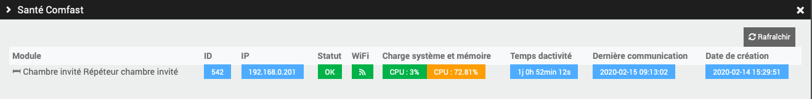

# Plugin routeur Tenda AC pour Jeedom

Plugin permettant de gérer les routeurs Comfast.

### Documentation

Vous trouverez la documentation [ici](https://github.com/Flobul/Jeedom-Comfast/tree/master/docs/fr_FR/index.md)

### Prévisualisation

### Fonctions disponibles

Infos :
* Etat du routeur
* Etat du Wifi
* Etat des LED
* Nom du routeur
* Nom des SSiD WiFi
* Version de firmware
* Type de CPU
* Charge système et mémoire

Actions :
* Reboot
* Backup

Scénarii possibles :
* Sauvegarder la configuration à intervales réguliers
