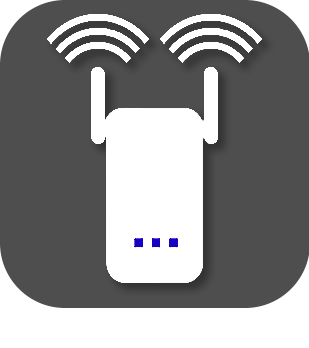

Présentation
============

Ce plugin permet de gérer les répéteurs Comfast.

Il permet de redémarrer le répéteur et de sauvegarder sa configuration.

Installation/Paramétrage
========================

Nous allons maintenant paramétrer un équipement. Pour se faire, cliquez sur *''Plugins / Communication / Comfast''

Puis cliquez sur le bouton en haut à gauche "*''Ajouter un équipement*''"

Puis saisir le nom de l'équipement (ex. Comfast WR753AC)

Puis définir :

-   *''Objet parent*''

-   *''Catégorie '*'(optionnelle)

-   *''Activer '*'(à cocher, sinon l’équipement ne sera pas utilisable)

-   *''Visible '*'(optionel si vous ne désirez pas le rendre visible sur le Dashboard)

-   *''Adresse IP*''

-   *''Mot de passe*''(optionnel si votre routeur n'en a pas)

-   *''Rafraichissement*''(par défaut sur 1 heure)

Dashboard
===

### FAQ
===

### A quelle fréquence les données sont-elles mises à jour ?
-------------------------------------------------------

Les données sont rafraichies toutes les heures par défaut.
Selectionnez la fréquence de rafraichissement des informations via la page Équipement.

### Ce plugin ne génère pas de log, comment en avoir ?
--------------------------------------------------
Il est nécessaire au préalable d’activer temporairement le debug de Jeedom (menu Configuration ⇒ Configuration des logs & messages ⇒ Activer + Niveau de log = Debug).

### J'aimerais remonter des erreurs/modifications directement dans le code ?
-----------------------------------------------------------------------
C’est tout à fait possible via
[github](https://github.com/Flobul/Jeedom-Comfast/)

### Liste des versions

*[Voir la liste des versions](changelog.md)*